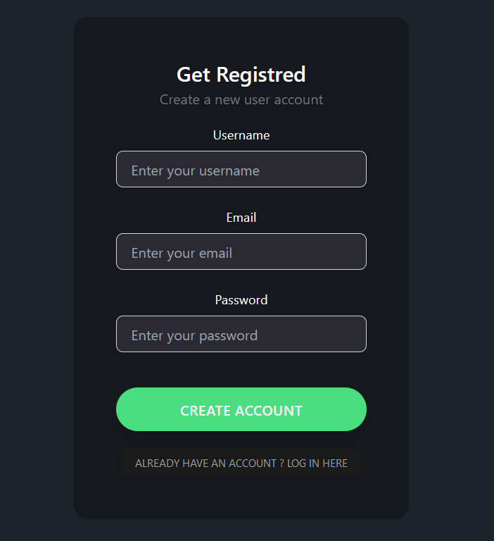
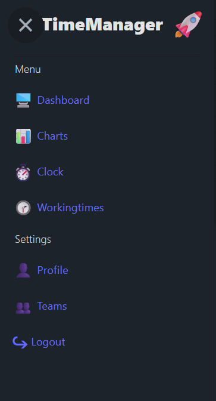
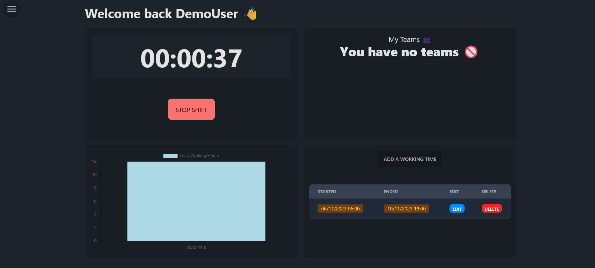
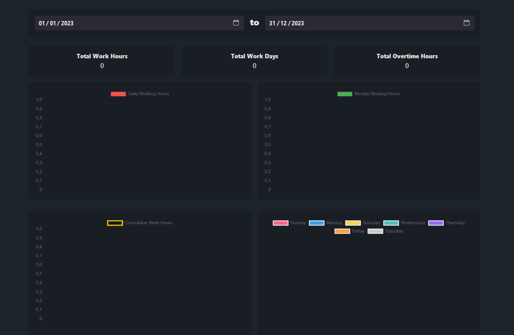
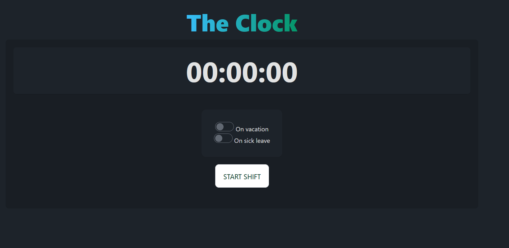
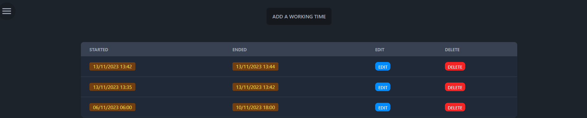
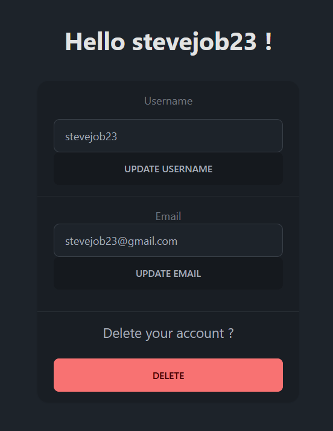
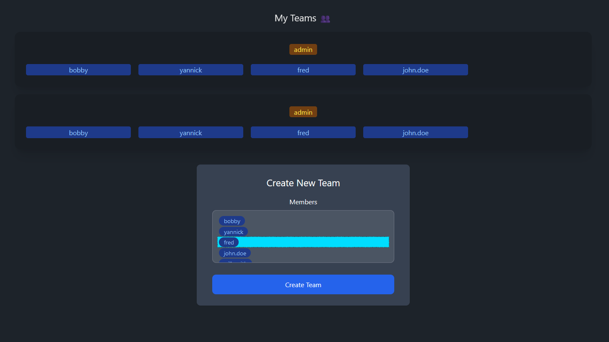

# TIME MANAGER
Version: 1.0
Last Updated: October 31, 2023

## Table of Contents

# TIME MANAGER - Documentation

1. [Introduction](#Introduction)
2. [Getting Started](#getting-started)
   - [Installation](#installation)
   - [Configuration](#configuration)
3. [Tutorial](#tutorial)
   - [Step 1: Configuration](#step-1-configuration)
   - [Step 2: Getting Started](#step-2-getting-started)
   - [Step 3: Advanced Usage](#step-3-advanced-usage)
4. [User Guide](#user-guide)
   - [Features](#features)
   - [Usage Examples](#usage-examples)
   - [FAQ](#faq)
5. [Contributing](#contributing)
6. [License](#license)

## Introduction

**CONTEXT**

The halls of Gotham Town Hall are currently embroiled in a growing revolt. Rumours of strikes and resignations are spreading like wildfire, and the primary trade union, the City of Gotham Trade Union (CGT-U), has raised an alarm to the Mayor and senior town hall officials about the urgency of the situation. The concerns highlighted include:

- Employees expressing dissatisfaction with their working conditions.
- Lengthy working shifts causing distress.
- Deteriorating conditions within the city.
- Batman's perceived lack of ethics and integrity.
- And more...

To mitigate these tensions and address the concerns of the municipal workers, the town hall has decided to conduct a comprehensive assessment of the situation. Additionally, they are considering the possibility of granting municipal employees some well-deserved time off for recuperation. To facilitate this, the town hall requires the implementation of a time management application, and this documentation provides an overview of the "TIME MANAGER" application.

**TIME MANAGER Application Overview**

The "TIME MANAGER" application is a custom software solution designed to help manage and optimise time-related aspects within the municipal workforce of Gotham. This application aims to address the concerns and needs expressed by the employees and the CGT-U trade union.

**Key Features of TIME MANAGER**

1. **Workload Analysis**: TIME MANAGER offers a comprehensive workload analysis feature. It allows the town hall to monitor and assess the working conditions of employees, ensuring fairness and compliance with labour regulations.

2. **Shift Management**: The application assists in managing and scheduling shifts efficiently. It aims to reduce the stress associated with extended working hours and irregular shifts.

3. **Leave Management**: TIME MANAGER facilitates the allocation and management of employee leave, enabling the provision of well-deserved days off for recuperation.

The "TIME MANAGER" application is a crucial tool that the town hall aims to implement to alleviate the ongoing tensions and enhance the overall work environment for municipal employees. This documentation serves as a guide to understand the purpose and key features of TIME MANAGER, demonstrating its potential to address the concerns voiced by the CGT-U and improve the working conditions in Gotham.

## Getting Started

### Installation

To install the software on mobile, please navigate to the link below and download the APK.

### Configuration

#### User Registration Documentation

This documentation provides guidelines and instructions for the user registration process, particularly focusing on the mandatory information that users must provide during registration. To ensure a seamless and secure experience, users are required to enter their email address and choose a username.

The registration process is the first step for users to gain access to our platform. It is a straightforward process that typically involves the following steps:

1. Click on the CREATE ACCOUNT button.
2. Fill out the required information.
3. Verify your email address (if applicable).

During the registration process, users must provide the following mandatory information:

- **Email Address**: Users are required to enter a valid email address. This is crucial for account verification, communication, and account recovery purposes.

- **Username**: Users must choose a unique username, which will be used as their identity on the platform. Username guidelines are outlined in the next section.

If users encounter any issues during the registration process, such as email verification problems or difficulty in choosing an appropriate username, they can reach out to our customer support team for assistance. Our support team is available to help users resolve any registration-related issues promptly.

## Tutorial

In order to utilise the application, you need to initially log in. If you don't already possess an account, you must commence by setting up one. Following that, you will be directed to the home page, where you will encounter this homepage.

This is what you should observe if you are using this app for the first time.

### Menu

You can use this menu to navigate throught the application and to access its various sections.

### Dashboard

The dashboard provides users with an overview of all their functionalities, enabling them to quickly and efficiently familiarise themselves with the system, ultimately saving them time.

### Charts

Charts enables the user to review the history of all their shifts. They can select a date range to view the number of hours worked and calculate the total in both days and hours to ensure they have not exceeded their allotted working hours. Conversely, if the employee has worked more than 40 hours, their salary will be doubled based on the hourly rate. If the employee has worked during the night, their salary will increase by 1.5 times their hourly rate. Additionally, the hours worked can be accrued as compensatory time, meaning that employees are not paid for these hours but can use them later to take time off.

### Clock

Clock allows users to start their shift hours. When an employee is absent during holidays, they have the option to toggle 'on vacation.' Similarly, if an employee has a day off due to sick leave, they can mark it. Weekends are not included in the shift hours (approximately 35 hours per week). 

If the user forgets to end their shift after 8 hours or forgets to clock out, a reminder email is sent to them directly in their mailbox :

### Workingtimes

Workingtimes enables employers to add, modify, and delete working hours at their convenience. To do so, users will need to click the 'Add Working Hours' button, and then proceed to add working hours by filling in the required fields accurately.

### Profile

The 'Profile' feature enables employers to make changes to specific fields in their accounts, such as the username, email, and ID. Employers can also opt to delete their accounts by providing their username and email for verification.

### Teams

Teams allows users to view all the teams they are members of. Managers have the ability to oversee multiple teams, create new ones, and delete existing ones. Meanwhile, administrators have full control over teams from their Admin panels.

### Admins

The Admin page provides the capability to manage all other users, including the ability to grant or revoke their rights, delete users, and perform various administrative tasks. This central hub empowers administrators with comprehensive control over user management, ensuring efficient and precise handling of user permissions and access.

The administrator can also create new accounts directly from this control panel. This feature allows for seamless account creation, enabling administrators to efficiently onboard new users and streamline the user management process.

sfdfssdf

sffsdsf

sefsfsfdf

### Logout

Finally, employers can log out of their accounts safely once their shifts have ended.

### Usage Examples

For an usage example, let's consider John Doe. John arrives at work at 9 am. He starts his shift on the clock page at 9 am and ends it at lunchtime, around 12:30 pm. He then returns to work at 2 pm and resumes his shift until 6 pm, when he leaves work and goes back home.

John Doe checks his dashboard in the morning to review his last recorded shift for the week, allowing him to manage his own schedule. His contract specifies that he should work 35 hours per week, but he notices that this week he has worked over 40 hours. He can then contact the timekeeping department to report his extra hours, which will entitle him to overtime pay.

The next morning, John Doe is unwell and unable to come to work, so he logs his absence as sick leave.

## FAQ

**1. What is TIME MANAGER?**

TIME MANAGER is a custom software application designed to assist in managing and optimising time-related aspects within the municipal workforce of Gotham. It aims to address employee concerns and improve working conditions.

**2. How do I install TIME MANAGER on my mobile device?**

To install the software on your mobile device, please navigate to the provided link and download the APK.

**3. What is the purpose of the 'Dashboard' feature?**

The 'Dashboard' feature allows users to review their shift history, calculate hours worked, and ensure compliance with weekly working hour limits. It also helps users monitor their salary and compensatory time.

**4. How can I use the 'Clock' feature?**

The 'Clock' feature enables users to start and end their shift hours. Users can also mark holidays or sick leave, and the system sends reminder emails for incomplete clock-ins or clock-outs.

**5. What is the 'Workingtimes' feature for?**

'Workingtimes' allows employers to add, modify, and delete working hours as needed. Users can access this feature by clicking 'Add Working Hours' and filling in the required information.

**6. How can I update my profile information?**

You can update your profile information, including your username, email, and ID, in the 'Profile' section. You also have the option to delete your account by providing your username and email for verification.

**7. How can I log out of my account?**

To log out safely, you can use the 'Logout' feature, which ensures a secure session termination.

**8. What should I do if I encounter issues during registration or other processes?**

If you face any problems during registration or while using the application, contact our customer support team for prompt assistance.

**9. Can employees report extra hours worked beyond their contract?**

Yes, employees can report extra hours worked beyond their contract to the timekeeping department, which may entitle them to overtime pay.

**10. How can I request sick leave in TIME MANAGER?**

You can log your absence as sick leave in the 'Clock' feature if you are unwell and unable to come to work.

Please feel free to contact our support team for any additional questions or concerns to timemanager.customservices@gmail.com

## Credits
**Kieran BOUDOUIN from Epitech**    
**Kouamé Yannick KOUAKOU from Epitech**
**Wijdan ABDERRAHMANI from Epitech**